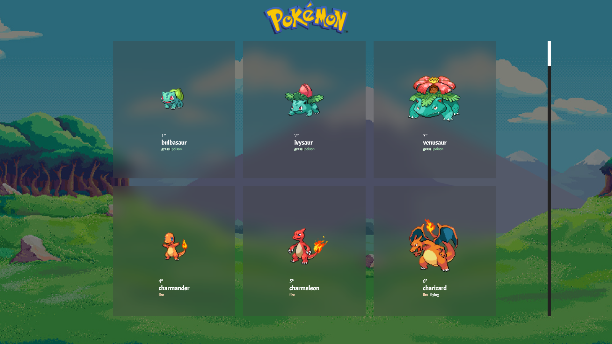

# PokeApi

Trabalho com intuito de estudar o uso de API

GitHUB

link do site do hospedado no GitHub
* https://geeansouza.github.io/xpokemon/

Figma

Figma
* https://www.figma.com/file/MlbLl632CovVwG7qk9kLQQ/Untitled?node-id=0%3A1

